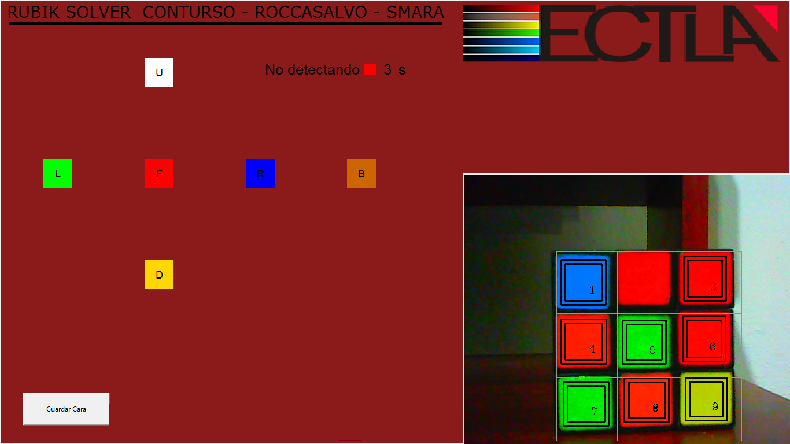
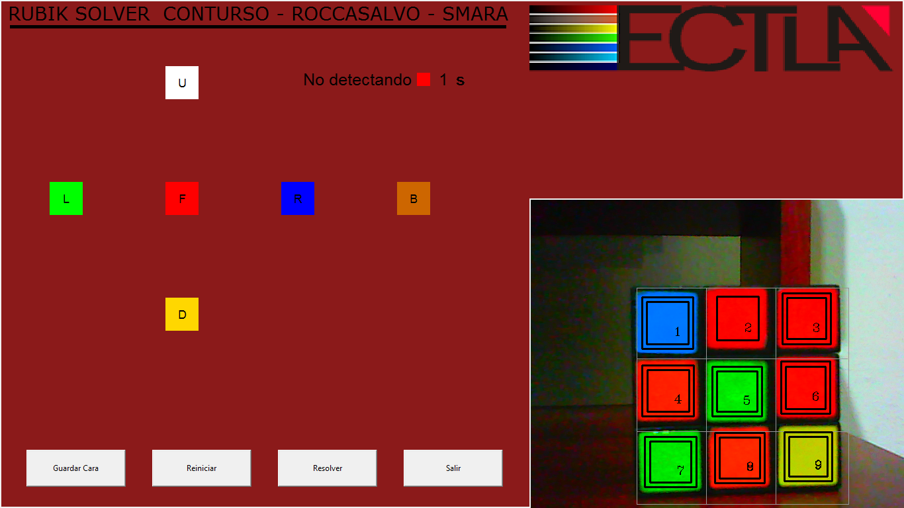
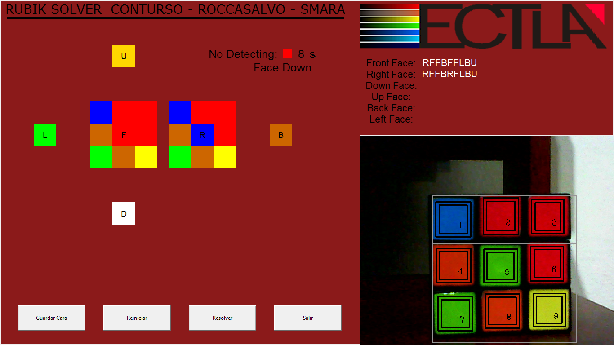

# RubikSolverRobot

An archived robotics project that detects a Rubik's Cube, calculates a solution,
and sends face-turn commands to an Arduino-driven mechanism.

The original prototype is preserved in [`legacy/`](legacy/). A small Python 3
command-line interface now documents and tests the core solver-to-robot protocol
without starting a camera or moving hardware by default.

> [!IMPORTANT]
> This is a historical showcase project, not a maintained hardware product.
> Servo geometry, camera thresholds, and timing values depend on the original
> prototype. Test all motion with the mechanism disconnected or unloaded first.

## What the prototype did

1. Captured the six cube faces with a webcam.
2. Classified sticker colors with OpenCV thresholds.
3. Used the Kociemba algorithm to calculate a solution.
4. Converted standard cube moves to a one-byte serial protocol.
5. Used an Arduino and two servos to reposition and turn the cube.


## Repository map

| Path | Purpose |
| --- | --- |
| `src/rubik_solver_robot/` | Safe Python 3 state validation, solving, and command encoding |
| `firmware/rubik_robot/` | Serial protocol test sketch; it does not move servos |
| `legacy/` | Unmodified original Python GUI and Arduino sketch |
| `docs/` | Architecture, hardware notes, and legacy limitations |
| `tests/` | Unit tests for cube-state and protocol rules |

## Try it without hardware

Python 3.10 or later is required.

```bash
python -m pip install -e .
rubik-robot --solution "R U R' U'"
```

The command prints the encoded bytes and does not open a serial port:

```text
Moves: R U R' U'
Commands: R U r u
Mode: dry run (no serial data sent)
```

You can also solve a 54-character cube state in `URFDLB` face order:

```bash
python -m pip install -e '.[solver]'
rubik-robot --cube-state UUUUUUUUURRRRRRRRRFFFFFFFFFDDDDDDDDDLLLLLLLLLBBBBBBBBB
```

Hardware execution is an explicit action:

```bash
python -m pip install -e '.[hardware]'
rubik-robot --solution "R U R' U'" --execute --port /dev/ttyACM0
```

Use a Windows port such as `COM5` when applicable. Read
[`docs/HARDWARE.md`](docs/HARDWARE.md) before you send commands.

## Protocol

The modern interface accepts standard moves for the six faces: `U`, `R`, `F`,
`D`, `L`, and `B`. A prime suffix means a counter-clockwise turn. A `2` suffix
means a half turn.

| Move | Serial byte | Move | Serial byte | Move | Serial byte |
| --- | --- | --- | --- | --- | --- |
| `F` | `F` | `F'` | `f` | `F2` | `1` |
| `B` | `B` | `B'` | `b` | `B2` | `2` |
| `U` | `U` | `U'` | `u` | `U2` | `3` |
| `D` | `D` | `D'` | `d` | `D2` | `4` |
| `L` | `L` | `L'` | `l` | `L2` | `5` |
| `R` | `R` | `R'` | `r` | `R2` | `6` |

## Historical screenshots







## Current limits

- The Python 3 interface does not replace the old camera GUI.
- The protocol test firmware does not drive the servo mechanism.
- The legacy Arduino sketch has known syntax and dispatch defects.
- The original color thresholds and motion values need hardware calibration.
- Exact compatibility with the original prototype is not a project goal.

See [`docs/LEGACY_NOTES.md`](docs/LEGACY_NOTES.md) for the audit details.

## Development

```bash
python -m unittest discover -s tests -v
python -m compileall -q src tests
```

## License

This repository is available under the [MIT License](LICENSE).
